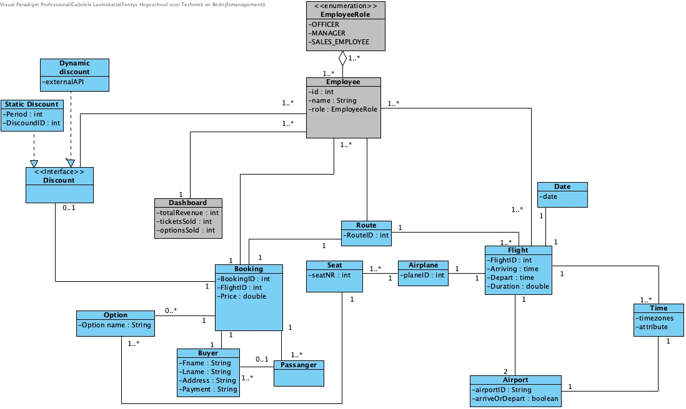

<h4> Step 1 -  making domain model brainstorm </h4>	
In this step, our team decided to brainstrom and used whiteboard for that. We listed all our entities from data dictionary in this draft. 

<h4> Step 2 -  fixing and brainstorming domain model </h4>	
In this step, we are applying the feedback that our team got from out couch.   Our team were missing some important things as for example "what happens if one person whats to book tickets for a six people" and it was important to fix understand of a route and a flight.

<h4> Step 3 -  digital domain model </h4>	
(waiting for a feedback if needed it will be fixed again)

<h4> Step 4 -  fixing domain model </h4>	
After feedback and couching hour it was decided to fix domain model

<h4> Step 5 -  fixing domain model </h4>	
After feedback and couching hour it was decided to fix domain model

